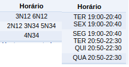

# Sigaa Unb - Volta Horário

\#SaudadesMatriculaWeb neh galera

Então partindo da ideia do [@luthierycosta](https://github.com/luthierycosta), fiz uma extensão para o Chrome que arruma os horários das aulas para uma coisa humana de se entender.

ALÔ CIC, me da crédito ai pelo esforço hehe

Aqui tem print de como ela funciona

## Link da Extensão: [Link pra chrome store](https://chrome.google.com/webstore/detail/sigaa-unb-volta-hor%C3%A1rio/mehmaliahkgafbndneaaajceobkgkebo?hl=pt-BRR)

## Pra quem não conseguir instalar por algum motivo - Para conseguir instalar pela chrome store de novo é necessário excluir a que foi instalada manualmente

Vou subir o arquivo .crx aqui, vai no chrome, canto superior direito e ativa o Modo do desenvolvedor

[Link sigraa-unb-volta-horario.crx](https://raw.githubusercontent.com/pablomuro/sigaa-unb-volta-horario/master/crx-extension/sigaa-unb-volta-horario.crx)

Arrasta o sigraa-unb-volta-horario.crx pra dentro do chrome e pronto

## Antes - > Depois

## Zoom

## Dúvidas / Sugestões / Achou erro : segue a lista
* [Abre um Issue aqui no Github](https://github.com/pablomuro/sigaa-unb-volta-horario/issues)
* Me manda um e-mail pablo.muro@gmail.com
* Ou me acha no CACOMP, me paga uma cerveja e vamos conversar :smiley: :beers: 
